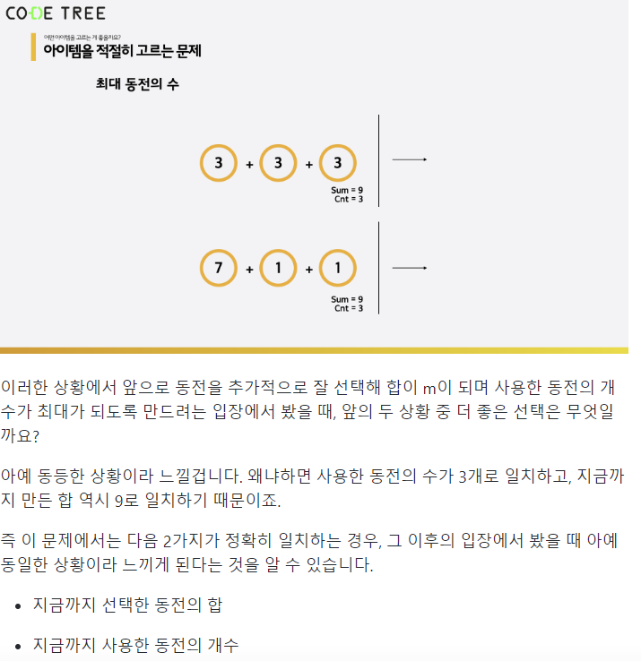

## 4. 동적계획법(DP)
 
 큰문제에 대한 답을 얻기 위해서 비교적 작은 문제를 플어서 큰문제를 해결.   
 피보나치 수열 같은 것.

 DP에서 핵심은 해당 풀이 알고리즘을 관통하는 하나의 점화식에서 어느단계든 동등한 상황으로 표현할 수 있는가? 가 핵심인듯. 이해가 안된다면 4.3~4문제 설명을 한번 잘보자.

   
 _약간 요런 느낌?.._

 (중간중간에 칸을 크개 띄울는 방법을 찾고 싶어.)

### * 구현 방식
 #### 1. 재귀를 이용해서 구한다  
  피보나치 같은 예시는 호출횟수가 너무 많이 걸림, 그러나 작은 수에 대해서는 반복문과 비슷.   

  큰걸 쪼개서 풀어나가는 방식 탑다운  
  작은거 부터 점점 큰걸로 확장 바텀 업  
  거의 성능차이 없고, 생각이 쉬워지는 쪽으로 해보자.

  이미 계산된 n의 값은 배열같은 곳에 저장해 두고 연산 필요시마다 끌어쓰면 같은 계산 경우에 해당되는 트리 아랫부분은 계신 필요  x  
  **이를 '메모리제이션'이라고 함**  

  하지만 결국 재귀 호출은 계속해서 스택을 잡아 먹기 때문에 너무 큰 깊이의 호출 (피보(10만))은 곤란. 이렇게 많이 호출 될 것 같으면 Tabulation을 이용 (반복문.)

 #### 2. 반복문을 이용해서 구한다.
 위와 같은 문제를 해결할 수 있기에 동적계획법 구현에 있어 범용성은 더 나음.

 그러나 재귀가 유용한 부분도 분명 있으니 잘 따져보가 하자.

 ## 조심할 사항들!
  * 계산 시 사용될 기계적으로 알수있는 초기 조건들 꼭채워주기. 피보나치(1) 같은거.

## 4.2 격자 이용.

(위에서도 포함하지만) 점화식을 이용.  
-> 반드시 큰문제 해결위한 초기조건 정의되 있어야. 
첫 번째 문제 개념 설정 잘되어 있는 듯.

 ## 조심할 사항들!
  * 내가 필요한 것이 무엇인지 제대로 알기 ex)이전 격자의 최소 값 != 이전 격자의 값. (탑다운으로 구했다면 이전 격자에는 값이 비어있겠지?) 

 